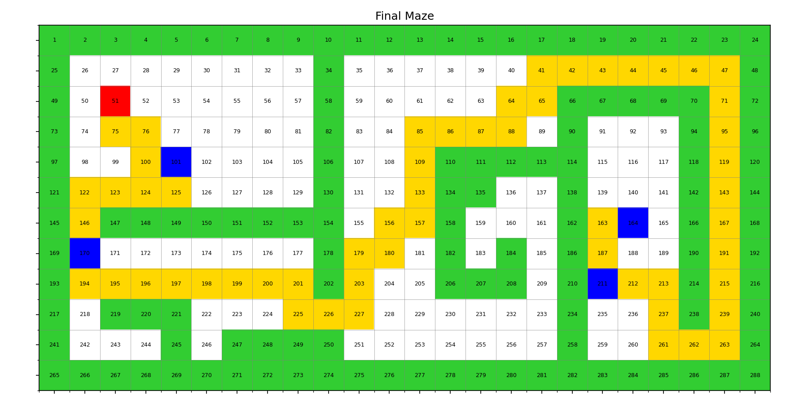
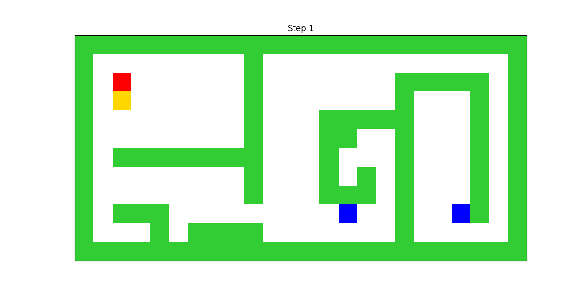
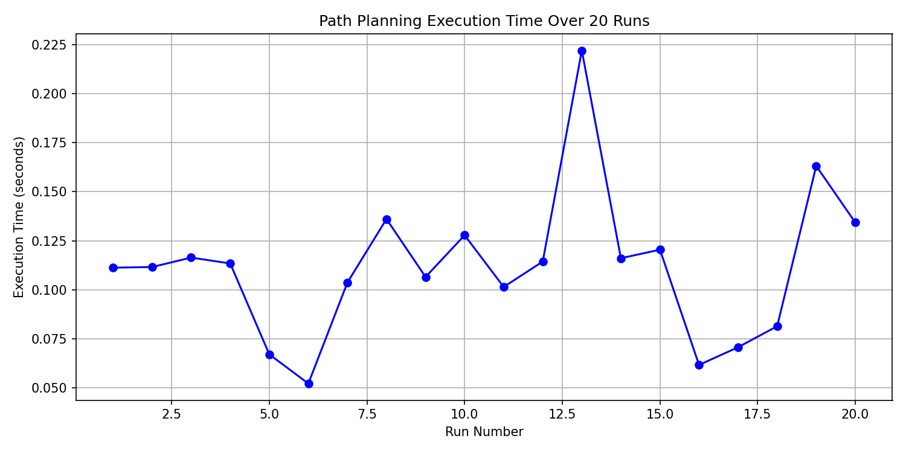

## ✅ Project Structure 

```
📁 robot-path-planner/
├── main_path_planner.py
├── performance_analysis.py
├── final_maze.png
├── robot_path.gif
├── performance_analysis.png
├── optimal_path.txt
├── README.md

```


````markdown
# 🤖 Robot Path Planner using A* (Multi-Target + Animation)

This project implements an intelligent **multi-goal robot path planner** using the **A\* (A-star) search algorithm**. It includes:

- Dynamic goal point generation (2–4 targets)
- Optimal path planning through all goals
- GIF animation of the robot’s journey
- PNG visualization of the final maze
- Performance analysis over 20 runs

---

## 📌 Features

- ✅ A\* pathfinding algorithm
- ✅ Supports 2 to 4 dynamic target points
- ✅ Tries all goal order permutations for shortest path
- ✅ Visualizes each step of the robot in a GIF (`robot_path.gif`)
- ✅ Saves final path view as PNG (`final_maze.png`)
- ✅ Saves stats & path as `optimal_path.txt`
- ✅ Analyzes speed over 20 runs in `performance_analysis.png`

---

## 🧠 Algorithms Used

- **A\*** for single pair shortest path
- **Brute-force permutations** to compute optimal visiting order for multiple targets

---

## 🖼 Sample Output

| Final Maze (`final_maze.png`) | Animated Path (`robot_path.gif`) |
|-------------------------------|-----------------------------------|
|        |           |

---

## 🔧 How to Run

### 🔹 One-time Execution

Runs the planner once, creates PNG & GIF.

```bash
python main.py
````

### 🔹 Performance Analysis (20 runs)

Collects execution time over 20 randomized runs.

```bash
python performance_analysis.py
```



---

## 📁 Files Explained

| File                       | Description                                |
| -------------------------- | ------------------------------------------ |
| `main_path_planner.py`     | Core logic: maze, A\*, GIF, PNG            |
| `performance_analysis.py`  | Repeats planner 20x and plots speed chart  |
| `final_maze.png`           | Image showing optimal path                 |
| `robot_path.gif`           | Animated robot path step-by-step           |
| `performance_analysis.png` | Line graph of execution time               |
| `optimal_path.txt`         | Text log of path, cell numbers, and timing |

---

## 📦 Requirements

```txt
matplotlib
numpy
heapq
itertools
random
time

```

Install them with:

```bash
pip install matplotlib numpy 
```

---

## 🚀 Future Improvements

* Add GUI or command-line options
* Add support for weighted mazes
* Use heuristics or TSP solver for large goal counts


 

 ## 📄 License

MIT License 

````


